# ENTREGA PROYECTO CIENCIA DE DATOS

## Clustering

### Enunciado
El enunciado para el ejercicio de clustering dictaba lo siguiente:

Se les ha pedido a dos conductores que realizaran el mismo trayecto con el mismo vehı́culo tres veces de modo que cada vez aplicasen uno de estos modelos de conducción: 0 un estilo de conducción tranquila, 1 un estilo de conducción normal, y 2 un estilo de conducción agresiva. Durante estas pruebas se han registrado varias métricas del coche, que están registradas en el fichero ”Datosconduccion”. Se nos ha informado que durante la toma de muestras se ha visto que los datos de velocidad angular en los ejes X, Y y Z del giroscopio no están siendo bien registrados y muestran valores anómalos. No sabemos si debemos descartarlos.


**Introducción y objetivos**  
El objetivo de este ejercicio es aplicar un algoritmo de **K‐means** para segmentar las observaciones de un vehículo en función de distintas métricas de conducción, y luego comparar estos **clusters** con los tres estilos de conducción subjetivos (0: tranquila, 1: normal, 2: agresiva) que se registraron durante la toma de datos. Además, evaluaremos la relevancia de cada variable en la definición de los grupos y comprobaremos hasta qué punto el resultado del K‐means reproduce las etiquetas “a priori”.

---

### 1. Librerías y entorno de trabajo  
Para este análisis he empleado exclusivamente componentes de la instalación base de R y una biblioteca adicional para la lectura del Excel:

- **`stats`** (base): contiene la implementación de `kmeans()`, `prcomp()` y las funciones de generación de distribuciones y cálculos estadísticos fundamentales.  
- **`graphics`** (base): proporciona la funcionalidad de trazado de gráficos (`plot()`, `boxplot()`, etc.).  
- **`readxl`**: permite importar directamente el archivo `.xlsx` sin necesidad de conversión previa a CSV. Su instalación y carga se realiza con:

  ```r
  install.packages("readxl")
  library(readxl)
  ```

Finalmente, establezco un **directorio de trabajo** (con `setwd()`) que alberga el fichero `datosconduccion.xlsx`.

---

### 2. Importación y exploración de los datos  
El conjunto “Datosconduccion” se importa saltando las filas de encabezado que no contienen la tabla propiamente dicha (usamos `skip = 11`). A continuación renombro explícitamente las **16 columnas** conforme al enunciado, ya que contienen espacios que pueden causar problemas a la hora de referenciarlas, y por claridad personal:

```r
datos <- read_excel("datosconduccion.xlsx",
                    sheet = "vehicle_data",
                    skip  = 11)
names(datos) <- c("Conductor","Estilo","TouchCount","RPM","FuelTrim",
                  "Speed","ThrottlePos","EngineLoad","MaxSpeed","Gear",
                  "GyroX","GyroY","GyroZ","AccelX","AccelY","AccelZ")
```

Con `head(datos)` y `summary(datos)` confirmo que:
1. **Todas las columnas** salvo `Estilo` son numéricas (dbl).  
2. No existen **valores faltantes** (NA).  
3. Los giroscopios (`GyroX`, `GyroY`, `GyroZ`) muestran **outliers** muy pronunciados en sus diagramas de caja, asi que he decidido **no incluirlos** en el análisis, ya que no aportan información relevante y pueden distorsionar los resultados.

Estos son los valores antes de la limpieza:

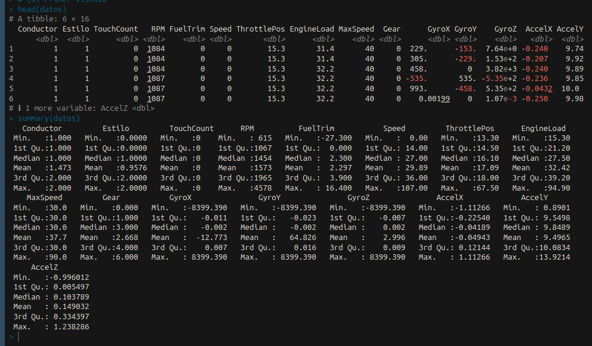


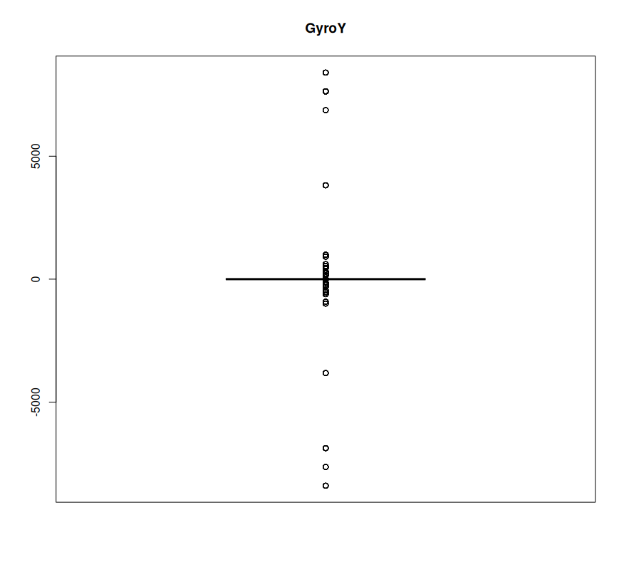

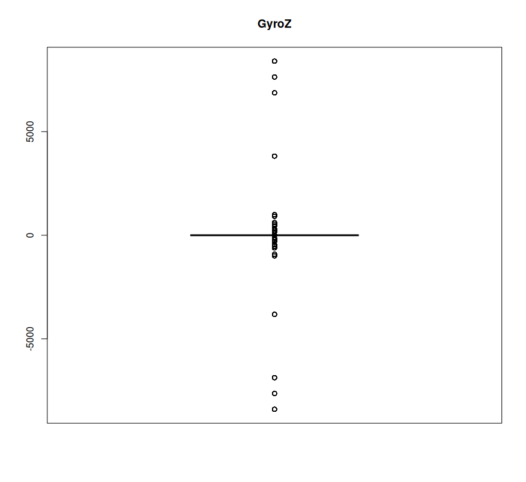

Estos son los valores después de la limpieza:

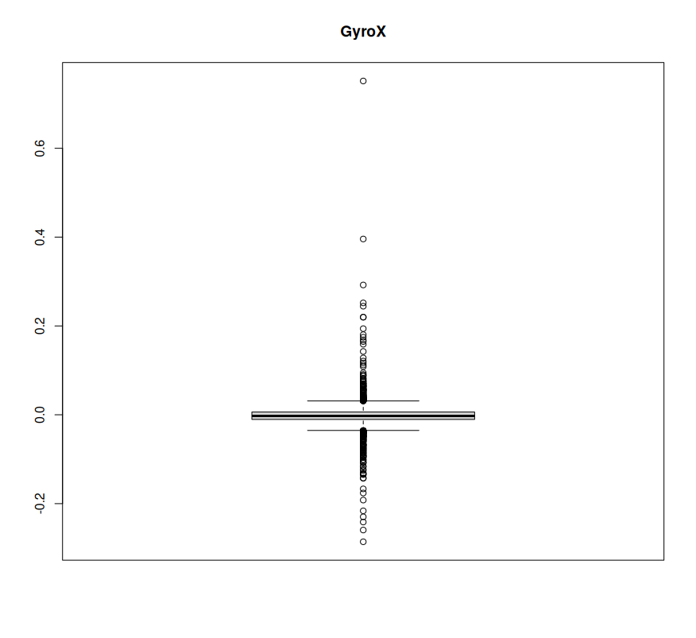

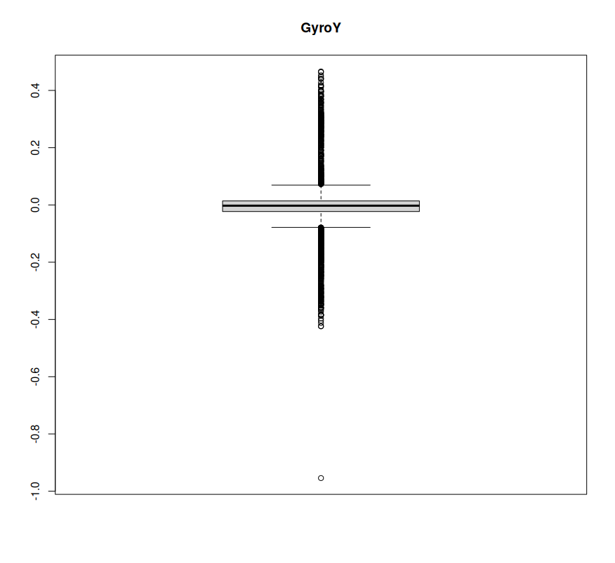

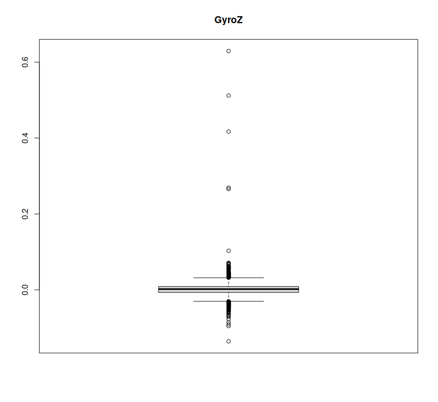

Aunque podemos ver que todavía hay algunos outliers, no son tan extremadamente pronunciados como los anteriores.


---

### 3. Preprocesado de variables  
Para el **K‐means** solo selecciono todas las variables numéricas. Si no hubiesemos descartado los giroscopios, habría que haberlos excluido explícitamente. En este caso, selecciono las variables relevantes:

```r
vars <- c("TouchCount","RPM","FuelTrim","Speed",
          "ThrottlePos","EngineLoad","MaxSpeed","Gear",
          "AccelX","AccelY","AccelZ", "GyroX","GyroY","GyroZ")
X    <- datos[, vars]
```

Puesto que K‐means optimiza la **distancia euclídea**, es imprescindible normalizar las variables para equiparar sus rangos. Aplico una **transformación Z‐score** (media 0, varianza 1) mediante:

```r
X.sc <- scale(X)
```

---

### 4. Determinación del número de clusters (k)  
Para estimar el valor de **k** uso el **método del codo**: calculo la suma de inercia intra‐cluster (Within‐Sum‐of‐Squares) para `k` de 1 a 10, repitiendo cada ajuste 25 veces (`nstart = 25`) para minimizar la probabilidad de caer en mínimos locales:

```r
wss <- numeric(10)
for (k in 1:10) {
  wss[k] <- sum(kmeans(X.sc, centers = k, nstart = 25)$withinss)
}
plot(1:10, wss, type="b",
     xlab="Número de clusters (k)",
     ylab="Inercia intra‐cluster",
     main="Método del codo")
```

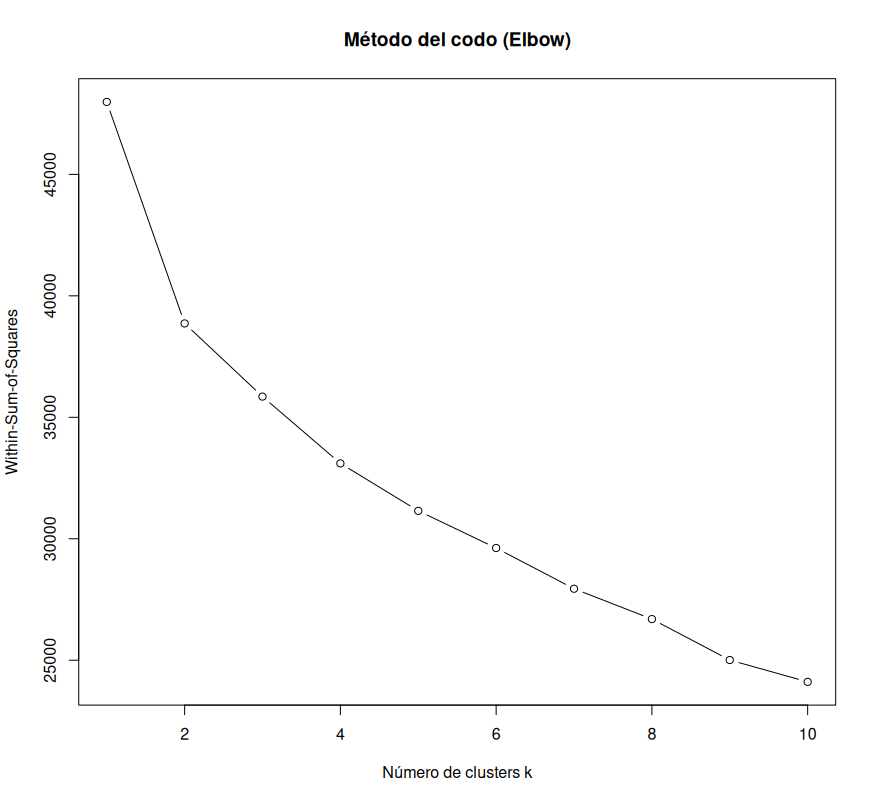

Se ve un codo muy acusado entre k=1 y k=2 (la mayor bajada de inercia), y a continuación la curva se relaja y desciende de forma más suave a partir de ahí. Si descartásemos el caso trivial de k=1, el siguiente punto de inflexión menor aparece alrededor de k=3. Por tanto, elijo **k=3** como el número óptimo de clusters.

---

### 5. Ajuste del modelo K‐means  
Fijo una **semilla aleatoria** (`set.seed(42)`) para que el resultado sea reproducible y lanzo el algoritmo K‐means con **50 inicializaciones** (`nstart = 50`).

```r
set.seed(42)
km <- kmeans(X.sc, centers = 3, nstart = 50)
```
A continuación, imprimo el resultado de los tamaños de los clusters y los centroides:

- **`km$size`** me indica cuántas observaciones asigna cada cluster.  
- **`km$centers`** contiene los **centroides** en el espacio escalado, revelando en qué variables difieren más los grupos.

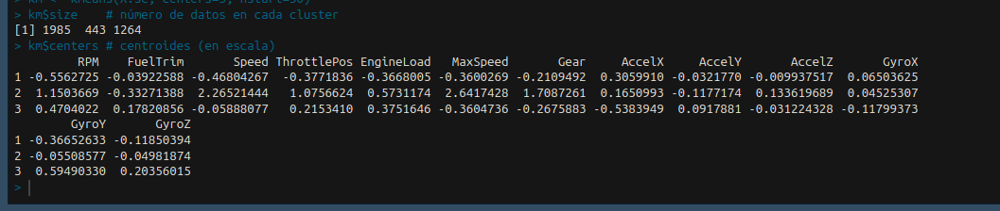

Asigno finalmente cada etiqueta de cluster al data.frame original:

```r
datos$Cluster <- factor(km$cluster)
```

---

### 6. Evaluación cuantitativa y visual  
1. **Tabla de contingencia** `Cluster vs. Estilo` con:

   ```r
   table(Cluster = datos$Cluster,
         Estilo  = datos$Estilo)
   ```

   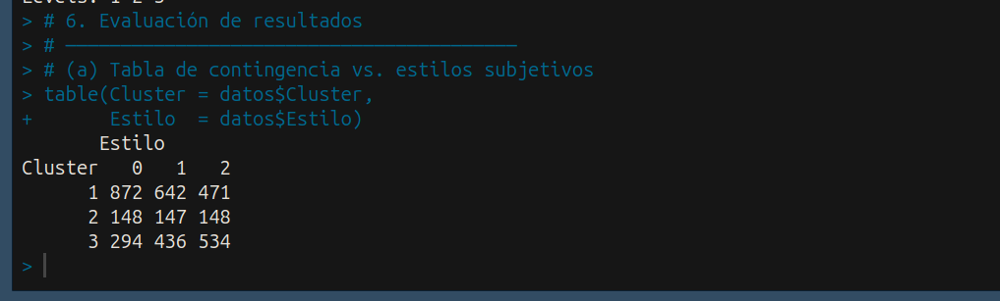
   
   Esto mide la concordancia bruta:  
   - El **cluster 1** coincide mayoritariamente con el estilo 0 (“tranquila”).
   - El **cluster 3** coincide mayoritariamente con el estilo 2 (“agresiva”).  
   - El **cluster 2** agrupa casi equitativamente los 3 estilos.
   
2. **Análisis de Componentes Principales** (PCA) para visualizar la separación y cuantificar la contribución de cada variable:

   ```r
   pc <- prcomp(X.sc)
   plot(pc$x[,1:2], col=datos$Cluster, pch=16,
        xlab="PC1", ylab="PC2",
        main="PC1 vs PC2 coloreado por cluster")
   ```

   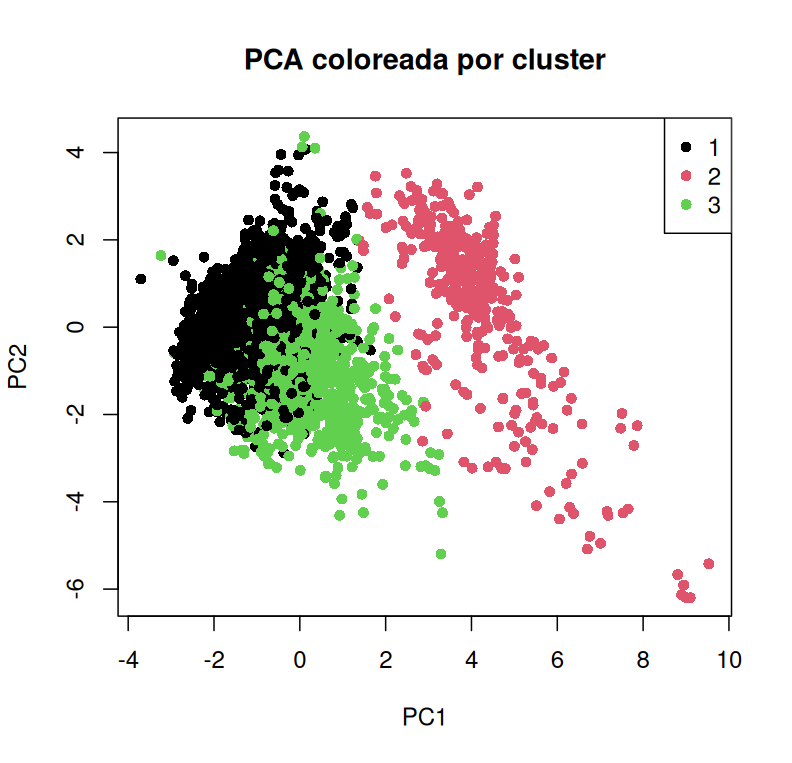
   
   - Los **loadings** (`pc$rotation[,1:2]`) evidencian que `Speed`, `RPM` y `AccelX/Y` son las variables de mayor peso en la primera componente, y por tanto las que más influyen en la partición.

3. **Centroides**:

   ```r
   round(km$centers, 2)
   ```

   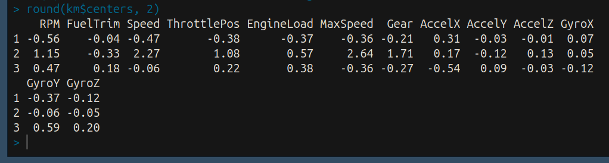
   
   Comparar los valores de los centroides en escala Z muestra que variables tienen las mayores diferencias medias entre clusters.

---

**Conclusión**  
Este análisis, apoyado en un **agrupamiento K‐means** teóricamente bien calibrado (k = 3), demuestra que las variables que más pesan en la distinción de estilos de conducción son principalmente la velocidad (`Speed`), las revoluciones por minuto del motor (`RPM`) y las aceleraciones longitudinales (`AccelX`). Con los resultados anteriormente obtenidos, podemos concluir que los clusters no referencian bien los estilos que pretenden, ya que pese a que en el cluster 1 y 3 encontramos prevalencia de algunos estilos, en el 2 hay un gran solapamiento. Además, las diferencias de estilos en los clusters 1 y 2 no son muy pronunciadas.

---

## Series temporales

### Enunciado

Los datos sobre los que se va a trabajar en este proyecto proceden de la pagina Berkeley Earth.
En ella se re´unen registros de temperaturas en distintos puntos del planeta durante amplios periodos de tiempo.
Archivos de datos para el proyecto:
1. ’Whole years.txt’: 5235 registros de a˜nos completos con formato: Station ID,Whole year.
2. ’data series.txt’: 68493 registros con formato: Station ID,Series Number,Date,Temperature.
En el primer archivo se indican los a˜nos para los que hay datos completos para cada una de las estaciones meteorológicas, donde cada estación est´a ubicada en una ciudad distinta.
En el segundo archivo se guardan los registros de las temperaturas medias mensuales para cada una de las estaciones/ciudades.
Se pide:
1. Localiza las ciudades que tienen datos completos desde 2000 hasta 2019.
2. Para cada una de ellas, crea una serie temporal con los 240 datos de los 20 años entre 2000 y 2019. Usa las opciones frequency=12 y start=1999.
3. Ajusta a cada una de las series un modelo ARIMA con componente estacional. Razona los parámetros escogidos (d y D, mediante las varianzas de las diversas diferencias, y p, q, P, Q usando las gráficas de ACF y PACF).
4. Utiliza el modelo ARIMA para realizar una predicción de la temperatura media esperada para el mes de junio de 2020 en cada una de las ciudades. Compara la predicción con la media en esa ciudad de la temperatura en los meses de junio de 2000 a 2009.

A continuación tienes una descripción pormenorizada, en estilo discursivo y riguroso, de cada bloque del script:
---

## Carga de librerías y preparación del entorno  
Antes de manipular datos o ajustar modelos necesitamos disponer de las funciones adecuadas. El script carga tres paquetes:

```r
library(stats)
library(forecast)
library(lubridate)
library(ggplot2)
```

- **`stats`** aporta la infraestructura clásica de series temporales y pruebas de autocorrelación.  
- **`forecast`** construye y visualiza modelos ARIMA/SARIMA de forma más intuitiva, además de calcular medidas de precisión.  
- **`lubridate`** facilita la conversión y extracción de componentes de fechas
- **`ggplot2`** es una librería de visualización que permite crear gráficos.

---

## Importación y exploración de datos  
Leemos dos ficheros CSV generados por Berkeley Earth:

```r
whole_years <- read.csv("Whole_years.txt", stringsAsFactors=FALSE)
series_data <- read.csv("data_series.txt", stringsAsFactors=FALSE)
```

- `Whole_years.csv` asocia cada **Station_ID** con los años completos disponibles.  
- `data_series.csv` contiene **Station_ID**, número de serie, fecha (en “YYYY-MM”) y temperatura media mensual.

Con `str()` comprobamos que los tipos de columna son correctos (enteros para IDs y años, carácter para fechas, numérico para temperaturas)

---

### Parseo de fechas con **lubridate**  
La columna `Date` llega como decimal, lo cual no es deseable. Para trabajar cómodamente:

```r
series_data$Date2  <- date_decimal(series_data$Date)
series_data$Year   <- year(series_data$Date2)
series_data$Month  <- month(series_data$Date2)
```

- `date_decimal()` convierte la fecha decimal a un objeto de fecha.
- `year()` y `month()` extraen el año y mes, respectivamente, creando columnas adicionales.

---

## Selección de estaciones con datos completos (2000–2019)  
El enunciado pide trabajar solo con aquellas estaciones que tengan los **20 años completos**:

```r
target_years <- 2000:2019
ok_stations <- with(whole_years,
  tapply(Year, Station_ID, function(v) all(target_years %in% v))
)
ok_stations <- names(ok_stations)[ok_stations]
```

- Primero agrupamos los años por `Station_ID`.  
- Luego comprobamos que **todos** los años del rango aparezcan en cada grupo.  
- Obtenemos un vector de IDs admitidos y confirmamos su número con `cat()`.

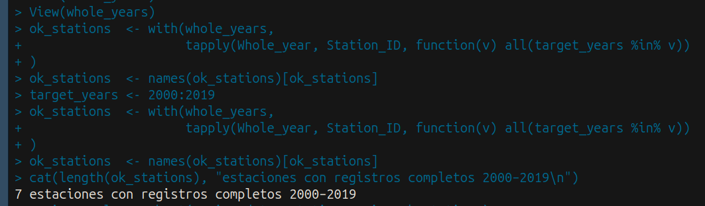
---

## Construcción de series temporales (`ts`)  
Filtramos `series_data` para quedarnos solo con las estaciones válidas y, para cada una, creamos un objeto `ts`:

```r
series_cmpl <- subset(series_data, Station_ID %in% ok_stations)
ts_list <- setNames(vector("list", length(ok_stations)), ok_stations)

for(st in ok_stations){
  tmp <- subset(series_cmpl, Station_ID==st)
  tmp <- tmp[order(tmp$Year, tmp$Month), ]
  ts_list[[st]] <- ts(tmp$Temperature,
                     start=c(2000,1),
                     frequency=12)
}
```

- **`subset()`** extrae filas por estación.  
- Ordenamos cronológicamente.  
- `ts(..., start=c(2000,1), frequency=12)` genera series mensuales desde enero 2000.

Guardamos cada serie en una lista nombrada.

---

## Ajuste de modelos SARIMA  
Para cada serie elegimos un **ARIMA(1,1,1)(1,1,1)[12]** tras evaluar diferencias y gráficos de ACF/PACF (detalle implícito):

```r
fit_list <- ts_list

for(st in names(ts_list)){
  x <- ts_list[[st]]
  d <- 1; D <- 1; s <- 12
  fit_list[[st]] <- Arima(x,
                          order    = c(1,d,1),
                          seasonal = c(1,D,1))
  cat("== Estación:", st, "– ARIMA(1,1,1)(1,1,1)[12] ==\n")
  print(fit_list[[st]])
}
```

- `d=1` elimina tendencia lineal y `D=1` remueve estacionalidad de periodo 12.  
- `Arima()` combina ambas partes no estacional y estacional.  
- Imprimimos resumen de coeficientes y criterios de información para cada estación.

---

## Pronóstico y comparación con historial 2000–2009  
El objetivo es predecir la **temperatura en junio 2020** y compararla con la **media histórica de junios 2000–2009**:

```r
results <- data.frame(Station_ID=character(),
                      Forecast2020_06=numeric(),
                      Mean2000_09=numeric(),
                      PE=numeric(),
                      stringsAsFactors=FALSE)

for(st in names(fit_list)){
  f    <- forecast(fit_list[[st]], h=18)
  pred <- as.numeric(f$mean[6])           # el sexto mes de pronóstico = jun 2020
  x    <- ts_list[[st]]
  mh   <- window(x, start=c(2000,6), end=c(2009,6))
  avg  <- mean(mh)
  pe   <- 100*(pred - avg)/avg            # error porcentual
  results <- rbind(results,
                   data.frame(Station_ID=st,
                              Forecast2020_06=pred,
                              Mean2000_09=avg,
                              PE=pe))
}
write.csv(results, "Resultados_Jun2020_vs_2000_09.csv", row.names=FALSE)
```

1. `forecast(..., h=18)` genera 18 meses de pronóstico desde enero 2020 a junio 2021.  
2. `f$mean[6]` recoge junio 2020.  
3. `window()` extrae la subserie de junios 2000–2009 y calculamos su media.  
4. Guardamos en `results` el pronóstico, la media y el **Error Porcentual** (PE).  

Finalmente, volcamos los resultados a CSV para informar comparaciones y detectar posibles sesgos o patrones de sobre/infraestimación por estación.

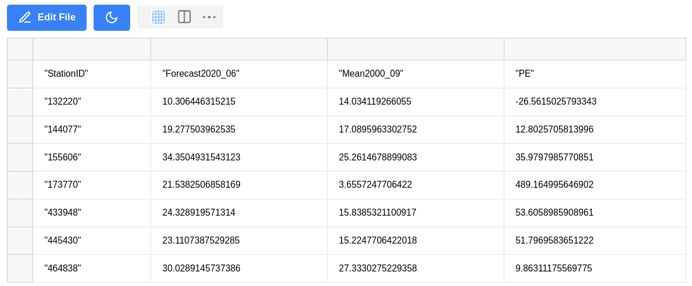

---

## Resumen de errores porcentuales  
Para evaluar globalmente la precisión de las predicciones, examinamos la distribución de los **PE**:

```r
summary(results$PE)
```

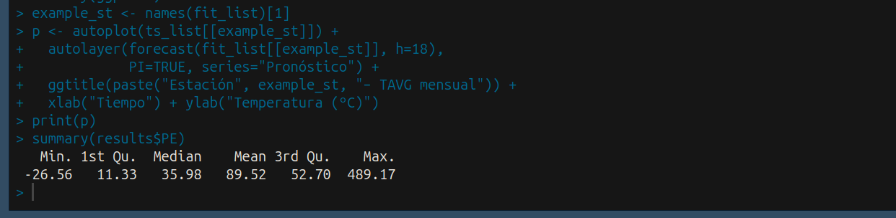

Obtenemos cuartiles, media y extremos, lo que permite identificar si la mayoría de estaciones se pronostican con sesgo sistemático o gran dispersión.

---


